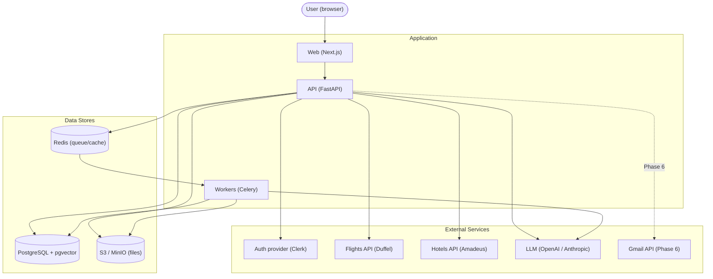
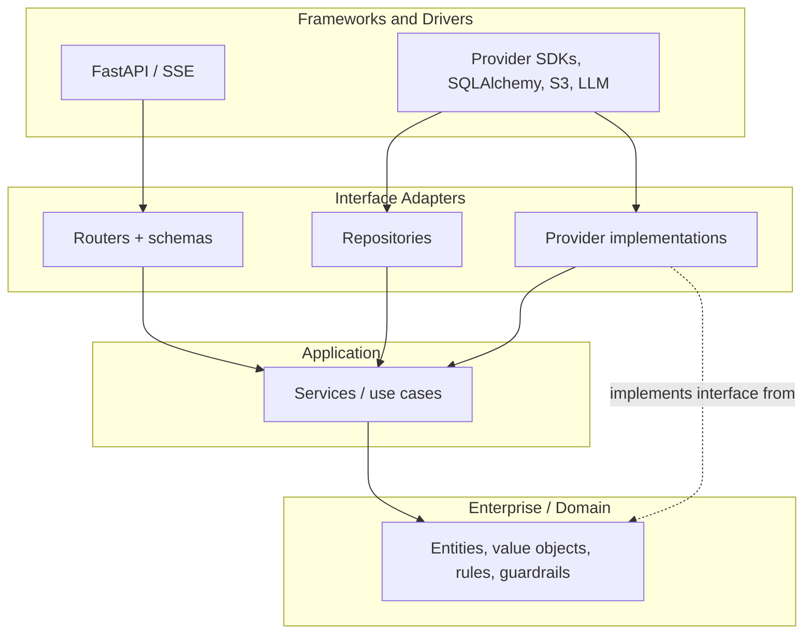
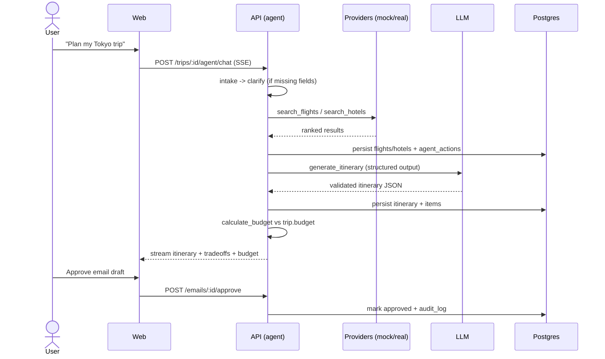
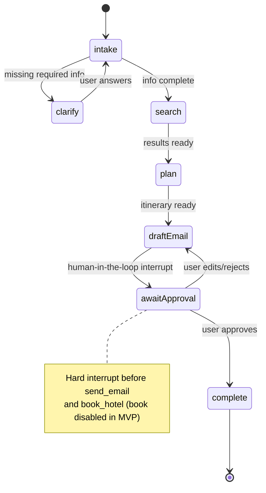
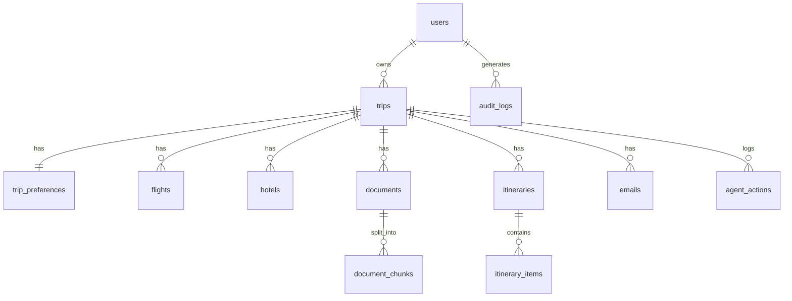
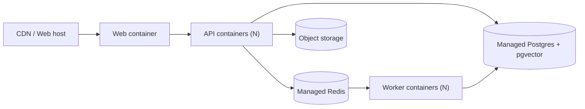

# AI Travel Planner Assistant — Architecture

> System design, clean-architecture layering, data flow, and agent design. Complements [PLAN.md](./PLAN.md) (delivery) and [REQUIREMENTS.md](./REQUIREMENTS.md) (what/why).

## 1. System Context

**Responsibilities**
- **Web:** UI, auth session, SSE streaming of agent chat, approval modals.
- **API:** REST + SSE, request validation, orchestration, agent runtime.
- **Workers:** long-running jobs (PDF parsing, embedding, itinerary generation) off the request path.
- **Postgres + pgvector:** relational data plus document embeddings in one store.
- **Redis:** Celery broker + light caching.
- **S3/MinIO:** uploaded PDFs behind short-TTL signed URLs.

---

## 2. Clean Architecture (Backend)

Dependencies point inward. Business rules (`domain/`) never import frameworks or SDKs. External systems live behind interfaces in `adapters/`, so a mock and a real provider are interchangeable — this is what makes offline dev and CI possible without API keys.

### Package structure (`apps/api/app/`)

| Path | Responsibility | May depend on |
|------|----------------|---------------|
| `domain/` | Entities (Trip, Itinerary, Budget), rules, guardrail predicates, provider interfaces | nothing external |
| `services/` | Use cases: search flights/hotels, parse doc, generate itinerary, draft email, calc budget | `domain/` |
| `adapters/providers/` | Duffel, Amadeus, and mock implementations of provider interfaces | `domain/` interfaces |
| `adapters/db/` | SQLAlchemy models, repositories, Alembic migrations | `domain/` |
| `adapters/storage/` | S3/MinIO client | — |
| `adapters/llm/` | LLM clients + versioned prompt registry | — |
| `agent/` | LangGraph graph, tools, guardrails, eval harness | `services/`, `domain/` |
| `api/` | Routers, request/response schemas, SSE | `services/` |
| `core/` | Config (Pydantic settings), logging, tracing, security, errors | — |

**Why this matters:** guardrails (no send/book without approval) live in `domain/` as pure, unit-testable predicates rather than as prompt text, so they cannot be bypassed by model output or prompt injection.

---

## 3. Data Flow: Plan a Trip (happy path)

Long jobs (PDF parse, embedding) are dispatched to Celery workers; the API streams status back over SSE. Correlation IDs propagate from the web request into worker jobs for end-to-end tracing.

---

## 4. Agent Design

### 4.1 State Machine (LangGraph)

### 4.2 Tools

| Tool | Layer it calls | Notes |
|------|----------------|-------|
| `search_flights` / `search_hotels` | services → providers | Mock by default; sandbox/real via config |
| `read_pdf` | services → db/pgvector | Returns chunks + source citation |
| `generate_itinerary` | services → llm | Structured output validated against schema |
| `calculate_budget` | domain | Pure function; no side effects |
| `draft_email` | services → llm | Produces draft only |
| `send_email` | services → email | Requires `user_approved == true` (guardrail) |
| `book_hotel` | — | Hard-disabled in MVP config |
| `get_weather` | services | Stub in MVP |

### 4.3 Guardrails (enforced in code)

- `send_email` and `book_hotel` are gated by `domain/` predicates that check explicit approval state, independent of LLM output.
- Tool outputs are validated against Pydantic schemas; invalid output → bounded repair retry → clear error.
- Every tool invocation is written to `agent_actions`; approvals to `audit_logs`.
- Uploaded document text is untrusted (see [REQUIREMENTS.md](./REQUIREMENTS.md#11-threat-model-lightweight-stride)).

---

## 5. Data Model

See [REQUIREMENTS.md §6](./REQUIREMENTS.md#6-data-model-core-tables) for the full table list. Key relationships:

---

## 6. Cross-Cutting Concerns

| Concern | Approach | Reference |
|---------|----------|-----------|
| Config | Pydantic `BaseSettings`, validated at startup | [PLAN.md §6](./PLAN.md#6-environments--deployment) |
| Logging/Tracing | Structured JSON + OpenTelemetry, correlation IDs | [PLAN.md §7](./PLAN.md#7-observability--ops) |
| Errors | Central handler → user-friendly messages + Sentry | [ENGINEERING.md](./ENGINEERING.md) |
| Security | JWT auth, row-level authz, signed URLs, secret scanning | [REQUIREMENTS.md §5.1](./REQUIREMENTS.md#51-security-nfr-sec) |
| Retries | Exponential backoff on provider calls; graceful fallback | [REQUIREMENTS.md §5.3](./REQUIREMENTS.md#53-reliability-nfr-rel) |

---

## 7. Target Deployment (post-MVP)

MVP runs on `docker-compose`. The production target (documented, not built for MVP):

- Container images tagged by SHA + SemVer; rollback via previous tag.
- Infrastructure as Code (Terraform) is the target for reproducible provisioning.
- Migrations run on deploy (expand/contract for backward compatibility).

---

## 8. Related Documents

- [PLAN.md](./PLAN.md) — Delivery plan and phase gates
- [REQUIREMENTS.md](./REQUIREMENTS.md) — Requirements, NFRs, threat model
- [ENGINEERING.md](./ENGINEERING.md) — Engineering practices
- [adr/](./adr/) — Architecture Decision Records
