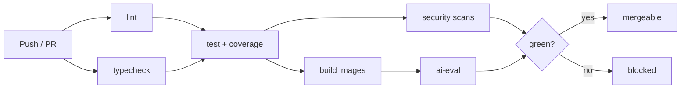

# AI Travel Planner Assistant — Engineering Practices

> The engineering handbook: how code moves from idea to `main`. Complements [PLAN.md](./PLAN.md). Even as a solo project, these practices keep the codebase reviewable, revertible, and auditable.

## 1. Version Control & Branching

- **Trunk-based:** `main` is always releasable and protected (no direct pushes).
- **Short-lived branches:** `feat/<slug>`, `fix/<slug>`, `chore/<slug>`, `docs/<slug>`, `refactor/<slug>`.
- **Rebase, keep history clean:** squash-merge PRs so `main` has one commit per change.

## 2. Conventional Commits

Format: `type(scope): summary`

```
feat(flights): add Duffel provider adapter
fix(agent): block send_email without approval
docs(plan): add CI/CD pipeline section
test(budget): cover over-budget warning threshold
chore(ci): add gitleaks scan job
```

Types: `feat`, `fix`, `docs`, `style`, `refactor`, `test`, `chore`, `perf`, `build`, `ci`. Commit type drives SemVer bump and CHANGELOG grouping.

## 3. Pull Request Workflow

Even solo, every change goes through a PR:

1. Branch from `main`.
2. Small, focused changes (split large work).
3. Open PR; CI must be green.
4. Complete the self-review checklist (below).
5. Squash-merge; delete branch.

### Self-review checklist
- [ ] Requirement ID referenced (`FR-*` / `NFR-*`)
- [ ] Tests added/updated; coverage gate green
- [ ] Lint, typecheck, security scans pass
- [ ] Observability added where relevant (logs/traces/metrics)
- [ ] Docs updated (README/RUNBOOK/ADR)
- [ ] CHANGELOG entry added
- [ ] No secrets, no debug prints, no commented-out code

## 4. CI/CD Pipeline

Runs on every PR and on `main` via GitHub Actions.



| Job | Tools | Blocks merge on |
|-----|-------|-----------------|
| lint | Ruff, ESLint, Prettier | violations |
| typecheck | mypy (strict), tsc | type errors |
| test | pytest, vitest | failures / low coverage |
| build | Docker Buildx | build failure |
| security | pip-audit, npm audit, Trivy, gitleaks | high-sev vuln / secret |
| ai-eval | agent eval harness | guardrail/golden regression |

### Pre-commit hooks (mirror CI locally)
Ruff (lint+format), Prettier, ESLint, mypy on changed files, gitleaks, EOF/whitespace fixers, Conventional Commit message lint.

## 5. Testing

Testing pyramid — many fast unit tests, fewer integration, few E2E.

| Layer | Scope | Tools | Gate |
|-------|-------|-------|------|
| Unit | Domain rules, budget, parsers, guardrails | pytest, vitest | domain/services ≥ 80% |
| Integration | API + DB + mock providers, RAG | pytest + compose/testcontainers | backend ≥ 70% |
| Agent/AI | Golden scenario, schemas, guardrails | pytest + eval harness | must pass |
| E2E | Full user flow | Playwright | must pass |
| Load | Search latency (optional) | k6 | informational |

**Principles**
- Deterministic tests: mock external providers with recorded fixtures.
- Test behavior, not implementation.
- Every bug fix adds a regression test.
- Guardrails and prompt-injection defenses have dedicated tests.

## 6. Code Style & Types

- **Python:** Ruff (lint + format), mypy strict, Pydantic for boundaries. Type hints everywhere.
- **TypeScript:** ESLint + Prettier, `strict: true`, no `any` without justification.
- **Shared contracts:** request/response types in `packages/shared` to keep web/api aligned.

## 7. Observability

| Concern | Standard |
|---------|----------|
| Logs | Structured JSON, correlation ID per request, no PII |
| Traces | OpenTelemetry spans across API → services → providers → LLM |
| Errors | Sentry with release + user context |
| Metrics | Latency (API + provider), LLM tokens, queue depth |
| Health | `/health` (liveness), `/ready` (deps) |

Correlation IDs propagate into Celery jobs so one trip action is traceable end-to-end. Triage steps live in [RUNBOOK.md](./RUNBOOK.md).

## 8. Security Practices

- **Secrets:** never in repo; `.env` local (git-ignored), secret manager in cloud; `gitleaks` in CI; `.env.example` documents all vars.
- **Dependencies:** `pip-audit` + `npm audit` + Trivy image scan in CI; no high-severity vulns merge.
- **Authz:** every resource access checks user ownership (row-level).
- **Uploads:** validate type/size before storage; signed URLs with short TTL.
- **Untrusted input:** document text is data, never instructions (prompt-injection defense).
- **Least privilege:** non-root container user; scoped API tokens.

## 9. Configuration & Environments

- 12-factor: all config via env vars, validated at startup (fail fast).
- Environments: `local` (mock providers) → `staging` (sandbox keys) → `prod`.
- Migrations: Alembic; backward-compatible (expand/contract); run on deploy.

## 10. Releases

- [SemVer](https://semver.org/): `MAJOR.MINOR.PATCH`.
- [Keep a Changelog](https://keepachangelog.com/) in [CHANGELOG.md](../CHANGELOG.md).
- Tag releases (`v0.1.0`); changelog generated from Conventional Commits.

## 11. Related Documents

- [PLAN.md](./PLAN.md) — Delivery plan and gates
- [ARCHITECTURE.md](./ARCHITECTURE.md) — System and agent design
- [RUNBOOK.md](./RUNBOOK.md) — Operations and recovery
- [../CONTRIBUTING.md](../CONTRIBUTING.md) — Contribution workflow
