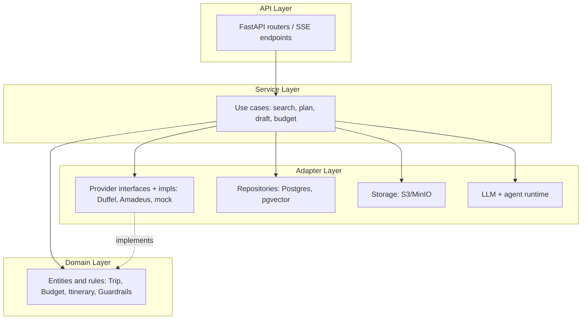
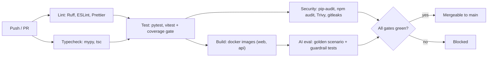
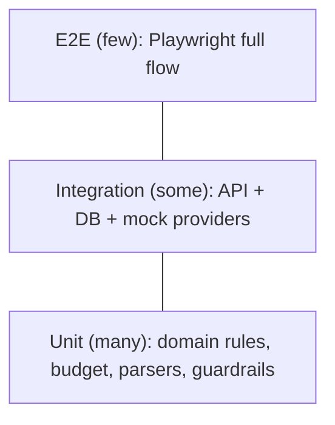
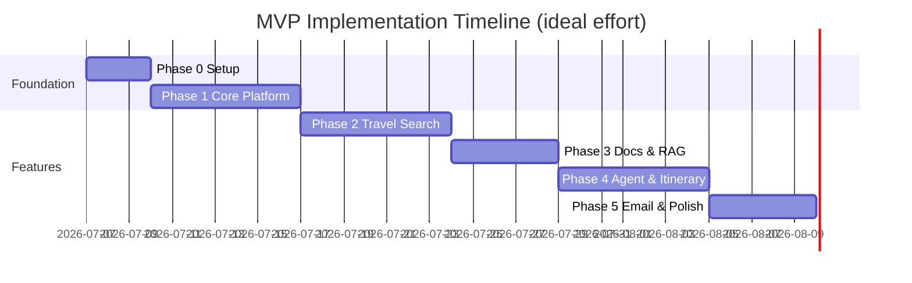

# AI Travel Planner Assistant — Implementation Plan

> This document is the delivery plan. It covers not just *what* to build but *how the project is run*: ways of working, engineering standards, CI/CD, environments, observability, and enforceable phase gates. It is written for a solo developer building a portfolio-grade, production-shaped codebase.

## Related Documents

- [REQUIREMENTS.md](./REQUIREMENTS.md) — Functional/non-functional requirements, traceability, threat model
- [ARCHITECTURE.md](./ARCHITECTURE.md) — System context, clean-architecture layers, data flow, agent design
- [ENGINEERING.md](./ENGINEERING.md) — Workflow, branching, CI/CD, testing, observability, security practices
- [RUNBOOK.md](./RUNBOOK.md) — Local setup, operations, failure recovery
- [adr/](./adr/) — Architecture Decision Records
- [../CONTRIBUTING.md](../CONTRIBUTING.md) — How to contribute and self-review
- [../CHANGELOG.md](../CHANGELOG.md) — Release history (SemVer)

---

## 1. Plan Summary

Build the MVP across **5 delivery phases** (plus Phase 0 setup), delivering a working planning assistant before any booking automation. Every phase ends with a demoable milestone and must pass enforceable gates: green CI, coverage thresholds, observability in place, and security checks clean.

**Recommended stack (MVP):**

| Layer | Choice | Rationale | Decision |
|-------|--------|-----------|----------|
| Frontend | Next.js 14+, React, TypeScript, Tailwind | App Router, SSR, strong ecosystem | [ADR-0006](./adr/0006-repo-layout.md) |
| Backend | FastAPI, Python 3.11+ | LangGraph native; async API | [ADR-0002](./adr/0002-backend-framework.md) |
| Database | PostgreSQL 15 + pgvector | Relational + embeddings in one DB | — |
| Queue | Redis + Celery | PDF parse, itinerary jobs | — |
| Storage | S3 / MinIO (local) | PDF files | — |
| AI | LangGraph + OpenAI or Anthropic | Stateful agent + HITL | — |
| PDF | PyMuPDF + Unstructured | Fast text + layout extraction | — |
| Auth | Clerk or NextAuth | Fast MVP auth | [ADR-0003](./adr/0003-auth-provider.md) |
| Flights | Duffel (sandbox) + mock | Simpler dev UX | [ADR-0004](./adr/0004-flight-api.md) |
| Hotels | Amadeus (sandbox) + mock | Fallback for MVP | [ADR-0005](./adr/0005-hotel-api.md) |
| Deploy | Docker Compose (local), cloud later | Reproducible dev | — |

**Repository layout:**

```
ai-travel-planner-agent/
├── apps/
│   ├── web/                 # Next.js frontend
│   └── api/                 # FastAPI backend (clean architecture, see §3)
├── packages/
│   └── shared/              # Shared types, validation schemas
├── docs/                    # This plan, requirements, architecture, ADRs, runbook
├── infra/
│   └── docker/              # Compose, Dockerfiles
├── .github/
│   └── workflows/           # CI/CD pipelines
├── .env.example
├── CONTRIBUTING.md
├── CHANGELOG.md
└── README.md
```

---

## 2. Ways of Working

Even as a solo project, the workflow mirrors a real team so the codebase stays reviewable, revertible, and auditable.

### 2.1 Version Control

- **Branching:** Trunk-based. `main` is always releasable. Work happens on short-lived branches: `feat/…`, `fix/…`, `chore/…`, `docs/…`.
- **Commits:** [Conventional Commits](https://www.conventionalcommits.org/) (`feat:`, `fix:`, `docs:`, `refactor:`, `test:`, `chore:`). This enables an automated changelog and SemVer bumps.
- **Pull Requests:** One PR per feature/fix, even solo. PRs must be small, pass CI, and go through the self-review checklist in [CONTRIBUTING.md](../CONTRIBUTING.md). No direct pushes to `main` (branch protection).
- **Releases:** [SemVer](https://semver.org/). Tag releases (`v0.1.0`, …). Maintain [CHANGELOG.md](../CHANGELOG.md) per [Keep a Changelog](https://keepachangelog.com/).

### 2.2 Issue & Task Discipline

- Each phase is a **milestone**; each task an issue with a **Definition of Ready** before it starts and a **Definition of Done** before it closes (see §9).
- Issue and PR templates live in `.github/` (created in Phase 0).

### 2.3 Definition of Ready (DoR)

A task is ready to start when:
- [ ] The requirement ID (`FR-*` / `NFR-*`) it satisfies is identified
- [ ] Acceptance criteria are written and testable
- [ ] External dependencies (API keys, migrations) are known
- [ ] It fits in a single small PR (split otherwise)

### 2.4 Definition of Done (DoD)

A task is done when:
- [ ] Code + tests written; coverage gate green (§4.3)
- [ ] Lint, typecheck, tests, security scans pass in CI
- [ ] Observability added (logs/traces/metrics where relevant)
- [ ] Docs updated (README/RUNBOOK/ADR as needed)
- [ ] Self-review checklist complete; CHANGELOG entry added
- [ ] Requirement traceability row updated in [REQUIREMENTS.md](./REQUIREMENTS.md#12-requirement-traceability)

---

## 3. Engineering Standards (Clean Architecture)

The backend follows a layered clean-architecture structure so business rules stay independent of frameworks and external APIs. This makes the "adapter + mock provider" strategy (Phase 2) natural and keeps agent tools testable.



**Dependency rule:** dependencies point inward. `domain/` depends on nothing external. `services/` orchestrate domain + adapters. `api/` is thin (validation + serialization). External providers sit behind interfaces so a mock and a real implementation are interchangeable.

**Proposed `apps/api` package structure:**

```
apps/api/app/
├── api/            # routers, request/response schemas (Pydantic), SSE
├── services/       # use cases (application logic)
├── domain/         # entities, value objects, business rules, guardrails
├── adapters/
│   ├── providers/  # flights/hotels: interface + duffel + amadeus + mock
│   ├── db/         # SQLAlchemy models, repositories, migrations (Alembic)
│   ├── storage/    # S3/MinIO client
│   └── llm/        # LLM clients, prompt registry
├── agent/          # LangGraph graph, tools, guardrails, eval harness
├── core/           # config, logging, tracing, security, errors
└── main.py         # app factory, dependency wiring
```

See [ARCHITECTURE.md](./ARCHITECTURE.md) for the full rationale and diagrams.

---

## 4. CI/CD Pipeline

All checks run in GitHub Actions on every PR and on `main`. Pre-commit hooks mirror the fast checks locally so failures are caught before push.



### 4.1 Jobs

| Job | Tools | Fails build when |
|-----|-------|------------------|
| lint | Ruff, ESLint, Prettier | Style/lint violations |
| typecheck | mypy (strict), tsc | Type errors |
| test | pytest, vitest | Test failures or coverage below gate |
| build | Docker Buildx (multi-stage) | Image build fails |
| security | pip-audit, npm audit, Trivy, gitleaks | High-severity vuln or leaked secret |
| ai-eval | agent eval harness | Guardrail or golden-path regression |

### 4.2 Pre-commit Hooks

Ruff (lint+format), Prettier, ESLint, mypy (changed files), gitleaks, end-of-file/trailing-whitespace fixers, and Conventional Commit message linting.

### 4.3 Coverage Gates

- **Domain + services: ≥ 80%** (core business rules and guardrails)
- **Overall backend: ≥ 70%**
- **Web (critical components/hooks): ≥ 60%**
- Coverage is reported in CI and blocks merge if below threshold.

### 4.4 CD (documented, provisioned post-MVP)

- Images tagged by git SHA and SemVer.
- Deploy pipeline: build → push registry → migrate → deploy → smoke test.
- Rollback = redeploy previous image tag. See §6.

---

## 5. Testing Strategy

A testing pyramid keeps feedback fast and confidence high.



| Layer | Scope | Tools |
|-------|-------|-------|
| Unit | Budget calc, validation, PDF field parsers, guardrail predicates | pytest, vitest |
| Integration | API endpoints + DB; mock flight/hotel providers; RAG retrieval | pytest + testcontainers/compose |
| Agent/AI | Golden Tokyo scenario, structured-output schema, guardrail assertions | pytest + eval harness (§8.5) |
| E2E | login → create trip → upload PDF → chat → approve email | Playwright |
| Load | Optional: search endpoints under target latency | k6 |

**Critical test scenarios (must always pass):**
1. Agent refuses to send email without approval.
2. Agent refuses to book hotel in MVP.
3. Budget warning triggers when flight + hotel > 80% of budget.
4. PDF extraction surfaces the correct check-in date.
5. External API failure shows a user-friendly message and retries.
6. Prompt-injection content in an uploaded PDF cannot trigger an unapproved action (see threat model).

**Test data strategy:** deterministic fixtures for provider responses (recorded/mock JSON), a seeded demo user + trip, and sample PDFs (hotel confirmation, conference agenda) checked into `apps/api/tests/fixtures/`.

---

## 6. Environments & Deployment

12-factor configuration: all config via environment variables; no secrets in the repo.

| Environment | Purpose | Data | Providers |
|-------------|---------|------|-----------|
| local | Dev via docker-compose | Ephemeral Postgres/MinIO | Mock providers by default |
| staging | Pre-prod verification | Isolated DB | Sandbox API keys |
| prod | Live (post-MVP) | Managed Postgres + object store | Production keys |

- **Config:** typed settings (Pydantic `BaseSettings`) with validation at startup; fail fast on missing required vars.
- **Secrets:** `.env` locally (git-ignored), secret manager in cloud; `gitleaks` in CI; `.env.example` documents every variable.
- **Images:** multi-stage Dockerfiles; non-root runtime user; pinned base images.
- **Migrations:** Alembic; run on deploy before app start; never auto-generate in prod without review.
- **Rollback:** redeploy previous image tag; migrations written to be backward-compatible (expand/contract).
- **IaC:** deferred for MVP but documented as the target (Terraform) in [ARCHITECTURE.md](./ARCHITECTURE.md).

---

## 7. Observability & Ops

Every phase adds observability so the system is debuggable from day one.

| Concern | Approach |
|---------|----------|
| Logging | Structured JSON logs with request/correlation IDs; no PII in logs |
| Tracing | OpenTelemetry spans across API → services → providers → LLM |
| Errors | Sentry (or equivalent) for exceptions with release + user context |
| Metrics | Request latency, provider latency, LLM token usage, queue depth |
| Health | `/health` (liveness) and `/ready` (dependencies: DB, Redis, storage) |
| Cost | LLM token + provider usage written to `api_usage`; simple cost dashboard |
| Audit | Every agent tool call and approval in `agent_actions` / `audit_logs` |

Correlation IDs propagate from the web request through Celery jobs so a single trip action is traceable end-to-end. See [RUNBOOK.md](./RUNBOOK.md) for triage steps.

---

## 8. Delivery Phases

Each phase is a milestone with a DoR, scoped tasks, a demoable deliverable, and enforceable exit gates (functional + CI + observability + security).

### Estimation note (solo capacity)

The durations below are **ideal engineering effort**, not calendar time. A solo developer working part-time should multiply by real availability and add a buffer for integration surprises (travel APIs, PDF quality). Treat the timeline as a sequence and relative sizing, not fixed dates.



| Phase | Ideal effort | Milestone |
|-------|--------------|-----------|
| 0 — Project setup | 2–3 days | Docker Compose up; CI green on skeleton |
| 1 — Core platform | ~1 week | Auth + trip CRUD + DB migrations |
| 2 — Travel search | ~1 week | Flight/hotel search UI + provider adapters |
| 3 — Documents & RAG | ~5 days | PDF upload, parse, vector search |
| 4 — Agent & itinerary | ~1 week | LangGraph agent + itinerary + eval harness |
| 5 — Email & polish | ~5 days | Email drafts, approval flow, audit, demo |

---

### Phase 0 — Project Setup

**DoR:** Repo created; ADRs for stack decisions accepted (§ [adr/](./adr/)).

**Tasks**
1. Initialize git repo, `.gitignore`, `.env.example`, branch protection on `main`.
2. Add `.github/` PR + issue templates and `CODEOWNERS`.
3. Create `apps/web` (Next.js) and `apps/api` (FastAPI) skeletons following §3 layout.
4. Docker Compose: Postgres (+ pgvector), Redis, MinIO, API, Web.
5. Alembic bootstrap; `/health` + `/ready` endpoints; structured logging + trace setup.
6. Shared types package (`Trip`, `Flight`, `Hotel`, …).
7. Tooling: Ruff, Prettier, ESLint, mypy, pre-commit hooks.
8. CI workflows: lint, typecheck, test, build, security scan.

**Deliverable:** `docker compose up` → web on `:3000`, API on `:8000`, `/health` OK; CI green on the skeleton.

**Exit gates**
- [ ] All services start cleanly; `/ready` reports DB + Redis + storage healthy
- [ ] CI pipeline green (lint, typecheck, test, build, security)
- [ ] Pre-commit hooks installed and documented in [RUNBOOK.md](./RUNBOOK.md)
- [ ] Structured logs emit correlation IDs

---

### Phase 1 — Core Platform

**DoR:** Auth provider ADR accepted; user/trip schema reviewed.

**Backend tasks**
1. Integrate Clerk/NextAuth; JWT validation middleware; per-user authorization.
2. Migrations: `users`, `trips`, `trip_preferences`.
3. REST endpoints: `POST/GET /trips`, `GET/PATCH /trips/:id`.
4. Trip validation service (required fields, date logic) in `domain/`.
5. Trip status enum: `draft | planning | ready | archived`.

**Frontend tasks**
1. Auth pages (login/signup redirect).
2. Dashboard — list trips with status badges.
3. New Trip form (all fields from FR-TRIP).
4. Trip detail shell with tab navigation.

**Deliverable:** User signs up, creates "Tokyo Oct 10–15" trip, sees it on the dashboard.

**Exit gates**
- [ ] Unauthorized requests rejected; users can only access their own trips
- [ ] Trip CRUD covered by API tests; domain coverage ≥ 80%
- [ ] Form validation matches FR-TRIP spec
- [ ] Traceability rows updated for FR-USER-01..03, FR-TRIP-01..04

---

### Phase 2 — Travel Search

**DoR:** Provider ADRs accepted; mock fixtures defined.

**Backend tasks**
1. Migrations: `flights`, `hotels`.
2. Provider interfaces in `adapters/providers/`; Duffel (flights), Amadeus sandbox (hotels), and a **mock provider** as default for offline dev.
3. Endpoints: search + select for flights and hotels.
4. `calculate_budget` service — flights + hotels + buffer vs. trip budget.
5. Retry with backoff + timeout on provider calls; graceful fallback + clear error.

**Frontend tasks**
1. Flights tab — search form, results cards, tradeoff summary UI.
2. Hotels tab — search form, results grid, booking link button.
3. Budget bar component on trip overview; updates on select.

**Agent prep**
- Define `search_flights` and `search_hotels` tool schemas (not wired yet).

**Deliverable:** Search SFO → NRT returns ranked flights; Shinjuku hotels with links.

**Exit gates**
- [ ] Provider timeout + retry verified via integration tests
- [ ] Mock provider works with no API keys (CI runs against mocks)
- [ ] Results persisted and linked to trip
- [ ] Provider latency metric emitted; search p95 < 10s (NFR-PERF)
- [ ] Traceability updated for FR-FLIGHT-*, FR-HOTEL-*

---

### Phase 3 — Documents & RAG

**DoR:** Storage configured; sample PDFs in fixtures.

**Backend tasks**
1. Migrations: `documents`, `document_chunks`.
2. S3 upload with presigned URLs; file size/type validation (≤ 20 MB, PDF only).
3. Celery task `parse_document`: PyMuPDF text, Unstructured tables (optional), LLM structured extraction (dates, codes, names).
4. Embed chunks → pgvector.
5. Endpoints: upload-url, parse, list, delete.
6. RAG query function for agent (`read_pdf`) returning chunks + source citations.
7. Input sanitization / prompt-injection mitigation on extracted text (threat model).

**Frontend tasks**
1. Documents tab — drag-drop upload, parse status, extracted fields preview.
2. Show "Source: filename.pdf" when agent uses doc context.

**Deliverable:** Upload hotel confirmation PDF → see check-in Oct 10, checkout Oct 15 extracted.

**Exit gates**
- [ ] Parse completes < 30s for a 10-page PDF (NFR-PERF); tested with fixture
- [ ] Chunks retrievable by semantic query (integration test)
- [ ] Delete removes S3 object + DB rows (FR-DOC-05)
- [ ] Prompt-injection fixture cannot trigger unapproved actions (§5 scenario 6)
- [ ] Traceability updated for FR-DOC-*

---

### Phase 4 — Agent & Itinerary

**DoR:** Search + docs available as tools; eval fixtures ready.

See §8.x below and the AI engineering additions in the plan. Key points:

**Backend tasks**
1. Migrations: `itineraries`, `itinerary_items`, `agent_actions`.
2. LangGraph graph: `intake → clarify (conditional) → search → plan → draft_email → END`.
3. Wire tools: `search_flights`, `search_hotels`, `read_pdf`, `generate_itinerary`, `calculate_budget`.
4. **Guardrails:** block `book_hotel` in MVP; block `send_email` unless approval token present. Implemented as domain predicates with unit tests.
5. `generate_itinerary` tool with structured output schema (days, cost, map URLs).
6. SSE streaming: `POST /trips/:id/agent/chat`.
7. Log every tool call to `agent_actions`; propagate correlation IDs into Celery.
8. **Prompt registry + versioning**; **structured-output validation**; **agent eval harness** (§ AI Engineering).

**Frontend tasks**
1. Chat panel with streaming messages.
2. Itinerary tab — day cards (morning/afternoon/evening), daily cost.
3. Regenerate itinerary button; clarifying-question UI.

**Deliverable:** User prompts Tokyo trip in chat → agent searches, asks if needed, produces 5-day itinerary.

**Exit gates**
- [ ] Full Tokyo golden-path scenario passes in CI (eval harness)
- [ ] Guardrail regression tests pass (no send/book without approval)
- [ ] Agent cites PDF when relevant; recommendations labeled vs. facts
- [ ] Budget updated after selections
- [ ] Itinerary generation < 20s (NFR-PERF); traces emitted per tool call
- [ ] Traceability updated for FR-ITIN-*, agent rules

---

### Phase 5 — Email & Polish

**DoR:** Itinerary output stable; audit schema reviewed.

**Backend tasks**
1. Migrations: `emails`, `audit_logs`.
2. `draft_email` tool — templates: itinerary summary, family share.
3. Itinerary PDF generation (WeasyPrint or reportlab).
4. Endpoints: draft, approve (mark + export), reject.
5. MVP send path: `.eml` download / copy HTML — Gmail OAuth deferred to Phase 6.
6. Audit middleware for searches, uploads, drafts, approvals.
7. Error-handling pass; `api_usage` cost logging finalized.

**Frontend tasks**
1. Email tab — preview, edit recipients/subject/body.
2. Approve / Reject buttons with confirmation modal.
3. Download itinerary PDF.
4. Empty states, loading skeletons, error toasts.
5. Privacy / Terms placeholder pages.

**Deliverable:** Complete demo: create trip → chat → itinerary → email draft → user approves.

**Exit gates**
- [ ] No email sent without an explicit approval action (test enforced)
- [ ] Audit log viewable as a trip activity feed
- [ ] README + RUNBOOK document all env vars and ops
- [ ] All MVP Definition of Done items in [REQUIREMENTS.md](./REQUIREMENTS.md#9-definition-of-done-mvp-release) checked
- [ ] Demo script (§13) runs clean end-to-end

---

## 9. Phase Gate Summary

Every phase must satisfy the same cross-cutting gates in addition to its functional exit criteria:

| Gate | Requirement |
|------|-------------|
| CI | lint + typecheck + tests + build + security all green |
| Coverage | domain/services ≥ 80%, backend ≥ 70% |
| Observability | logs with correlation IDs; traces for new paths; relevant metrics |
| Security | no high-severity vulns; no secrets committed; authz enforced |
| Docs | README/RUNBOOK/ADR/CHANGELOG updated; traceability rows added |

---

## 10. AI Engineering Practices (Phase 4 focus)

AI features get the same rigor as the rest of the system.

### 10.1 Prompt Management
- Prompts live in a versioned **prompt registry** (`adapters/llm/prompts/`), not inline strings.
- Each prompt has an ID + version; changes go through PR review and are noted in the CHANGELOG.

### 10.2 Structured Outputs
- Tool outputs (itinerary, extraction, tradeoff summary) are validated against Pydantic schemas.
- Invalid model output triggers a bounded retry with a repair prompt, then a clear error (no silent bad data).

### 10.3 Guardrails as Code
- Approval + booking guardrails are **domain predicates** with unit tests, not just prompt instructions.
- `send_email` requires `user_approved == true`; `book_hotel` is hard-disabled in MVP config.

### 10.4 Token & Cost Tracking
- Every LLM call records model, tokens, and estimated cost to `api_usage`.
- A simple dashboard/report surfaces cost per trip and per day.

### 10.5 Agent Eval Harness (runs in CI)
- **Golden path:** the Tokyo scenario with recorded provider fixtures asserts the agent reaches a complete itinerary + email draft.
- **Guardrail suite:** adversarial inputs (including PDF prompt injection) assert the agent never sends or books without approval.
- **Regression:** eval runs on every PR touching `agent/`, `services/`, or prompts; failures block merge.

---

## 11. API Design (High Level)

```
Auth
  POST   /auth/webhook          # Clerk/Auth provider

Trips
  GET    /trips
  POST   /trips
  GET    /trips/:id
  PATCH  /trips/:id

Flights
  POST   /trips/:id/flights/search
  POST   /trips/:id/flights/:flightId/select

Hotels
  POST   /trips/:id/hotels/search
  POST   /trips/:id/hotels/:hotelId/select

Documents
  POST   /trips/:id/documents/upload-url
  POST   /trips/:id/documents/:id/parse
  GET    /trips/:id/documents
  DELETE /trips/:id/documents/:id

Itinerary
  POST   /trips/:id/itinerary/generate
  GET    /trips/:id/itinerary

Agent
  POST   /trips/:id/agent/chat      # SSE stream

Emails
  POST   /trips/:id/emails/draft
  PATCH  /trips/:id/emails/:id
  POST   /trips/:id/emails/:id/approve
  POST   /trips/:id/emails/:id/reject

Audit
  GET    /trips/:id/activity

Ops
  GET    /health                    # liveness
  GET    /ready                     # readiness (DB, Redis, storage)
```

---

## 12. Risk Register

| Risk | Impact | Likelihood | Mitigation |
|------|--------|-----------|------------|
| Flight/hotel API approval delays | Blocks real data | Medium | Mock provider + sandbox keys from day 1 |
| PDF extraction quality | Wrong itinerary times | High | Human-readable extraction preview; user correction; fixtures in tests |
| Agent hallucinations | Bad recommendations | Medium | Tool-grounded answers; cite sources; structured outputs + validation |
| Prompt injection via PDF | Unapproved actions | Medium | Guardrails as code; injection eval suite; treat doc text as untrusted |
| LLM cost overruns | Budget | Medium | Cache itineraries; limit chat turns; `api_usage` tracking + alerts |
| Solo bandwidth | Timeline slip | High | Ideal-effort estimates; strict MVP scope; small PRs |
| Scope creep | Delayed MVP | Medium | Booking/OAuth deferred to Phase 6+; ADRs to freeze decisions |

---

## 13. Post-MVP Roadmap

| Phase | Features | Est. |
|-------|----------|------|
| 6 | Gmail OAuth, real `send_email`, calendar read | ~2 weeks |
| 7 | Traveler profiles, encrypted passport storage | ~1 week |
| 8 | Hotel booking flow + payment partner | ~3 weeks |
| 9 | Weather-aware itinerary, live price refresh | ~2 weeks |
| 10 | Production deploy (IaC), monitoring, rate limits | ~2 weeks |

---

## 14. Environment Variables (Starter)

```bash
# App
DATABASE_URL=postgresql://...
REDIS_URL=redis://...
S3_ENDPOINT=...
S3_BUCKET=travel-docs
APP_ENV=local            # local | staging | prod
LOG_LEVEL=info

# Auth
CLERK_SECRET_KEY=...
NEXT_PUBLIC_CLERK_PUBLISHABLE_KEY=...

# AI
OPENAI_API_KEY=...          # or ANTHROPIC_API_KEY
LLM_MODEL=gpt-4o-mini       # example default

# Travel APIs
DUFFEL_API_TOKEN=...
AMADEUS_CLIENT_ID=...
AMADEUS_CLIENT_SECRET=...
USE_MOCK_PROVIDERS=true     # default true for local/CI

# Observability
SENTRY_DSN=...
OTEL_EXPORTER_OTLP_ENDPOINT=...

# Email (Phase 6)
GOOGLE_CLIENT_ID=...
GOOGLE_CLIENT_SECRET=...
```

Every variable here is mirrored in `.env.example` and validated at startup (§6).

---

## 15. First Sprint Backlog (Start Here)

1. **P0-1** ADRs accepted for stack decisions
2. **P0-2** Docker Compose with Postgres, Redis, MinIO
3. **P0-3** FastAPI skeleton (clean-architecture layout) + Alembic + `/health` + `/ready`
4. **P0-4** Next.js app + API client + Tailwind
5. **P0-5** CI workflows (lint, typecheck, test, build, security) + pre-commit
6. **P1-1** Auth integration (Clerk recommended)
7. **P1-2** `users` + `trips` migrations and CRUD
8. **P1-3** Trip form UI + dashboard
9. **P2-1** Mock flight/hotel providers behind interfaces
10. **P2-2** Duffel flight adapter + budget bar

---

## 16. Demo Script (MVP Sign-off)

1. Log in as `demo@example.com`.
2. Create trip: SF → Tokyo, Oct 10–15, 2 travelers, $4,000, food + museums.
3. Open chat: "Plan my trip".
4. Agent asks for any missing info (if form incomplete).
5. Agent presents flight options (Best Value / Fastest / Cheapest).
6. User selects flight; budget bar updates.
7. Agent presents hotels near Shinjuku Station.
8. User uploads hotel confirmation PDF; agent cites check-in time.
9. Agent generates 5-day itinerary with daily costs.
10. Agent drafts email to self; user reviews and approves.
11. Show audit log of all agent actions.
12. Confirm no booking was made; hotel shows external booking link only.
